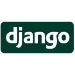

### Hello 👋, and welcome to my GitHub profile!

I am **Komlan ZANKPE**, a Senior Devops Engineer from Paris (France). I'm certified in **Azure Cloud**, and I love helping teams streamline their deployment pipelines and optimize their cloud usage. With over 8 years of experience in the tech industry , I have worked on wide range of transformational projects to help team transition to the cloud. With an insatiable curiosity and a relentless drive for self-improvement, I continually seek opportunities to ascend to new heights of expertise and innovation.

---

## 🤖 Technologies

     

---

## 💼 What am I working on?

I am currently diving deeper into Kubernetes and exploring the world of Platform engineering. I am also learning about the intersection of AI and DevOps.

---

## 🌱 What am I currently learning?

- Golang
- Hybrid Architecture
- Platform Engineering
- Site Reliability Engineering

---
## &#x1f4c8; My Stats

---

## 🤝 Let's Connect

- Learn more about me, visit my online [resume](https://me.kzankpe.com).
- Let's connect on Twitter at [@kzankpe](https://twitter.com/kzankpe)
